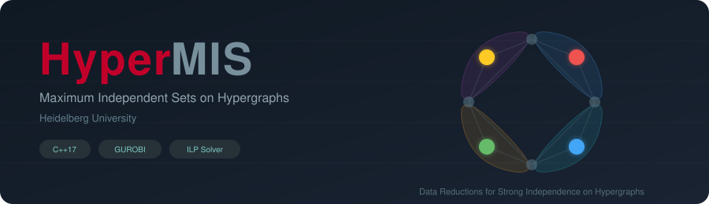

# HyperMIS &mdash; Maximum Independent Sets on Hypergraphs

<p align="center">
  <a href="https://opensource.org/licenses/MIT"></a>
  
  <a href="https://cmake.org/"></a>
  <a href="https://github.com/KarlsruheMIS/HyperMIS"></a>
  <a href="https://app.codacy.com/gh/KarlsruheMIS/HyperMIS?utm_source=github.com&utm_medium=referral&utm_content=KarlsruheMIS/HyperMIS&utm_campaign=Badge_Grade"></a>
  <a href="https://github.com/KarlsruheMIS/HyperMIS/stargazers"></a>
  <a href="https://github.com/KarlsruheMIS/HyperMIS/issues"></a>
  <a href="https://github.com/KarlsruheMIS/HyperMIS/commits"></a>
  <a href="https://arxiv.org/abs/2602.10781"></a>
  <a href="https://www.uni-heidelberg.de"></a>
  <a href="https://www.hamilton.edu"></a>
</p>

<p align="center">
  
</p>

Part of the [KarlsruheMIS](https://github.com/KarlsruheMIS) organization.

## Description

Given a hypergraph $H = (V, \mathcal{E})$, a **strong independent set** is a subset $S \subseteq V$ such that each hyperedge contains **at most one** vertex from $S$. Finding a maximum strong independent set is NP-hard. HyperMIS provides an ILP-based exact solver with data reduction preprocessing that shrinks instances to approximately 22% of their original size, achieving average speedups of 3.84&times; and up to 53&times; on real-world instances.

The solver implements nine reduction rules &mdash; including degree-one, twin, sunflower, clique, domination, and unconfined reductions &mdash; as a preprocessing step for any solver. Applications include constructing **perfect minimal hash functions** and other combinatorial optimization tasks on hypergraphs.

This is joint work by Ernestine Gro&szlig;mann, Christian Schulz, Darren Strash, and Antonie Wagner.

## Installation

### Dependencies

- **GCC** (g++) with C++17 support
- **CMake** 3.13+
- **GUROBI** ILP solver &mdash; set `GUROBI_HOME` in `CMakeLists.txt` to match your installation

### Build from source

```bash
mkdir build && cd build
cmake ..
make
```

This produces the following executables:

| Executable | Description |
|:-----------|:------------|
| `run_ilp` | Solve MIS on hypergraphs (with optional reductions) |
| `run_ilp_graph` | Solve MIS on standard graphs (with optional reductions) |
| `run_reduce` | Apply reduction rules only |
| `hypergraph_to_graph` | Convert hypergraph to standard graph format |

## Program Options

| Option | Description | Default | Mandatory |
|-|-|-|-|
| `-h` | Display help information | | |
| `-v` | Verbose mode, shows continuous updates to STDOUT | | |
| `-g path` | Path to the input hypergraph, see input format | | &check; |
| `-o path` | Path to the output for the reduced hypergraph | | |
| `-t sec` | Timeout in seconds | 3600 (1h) | |
| `-s seed` | User-specific input seed | | |
| `-r` | Enable reductions | | |
| `-e` | Experiment configuration for reduction statistics | | |

The output without the `-v` option is a single CSV line:
```
instance_name,algo,#vertices,#edges,avg_edge_size,#vertices_reduced,#edges_reduced,avg_edge_size_reduced,offset,time,seed
```
The output without the `-e` option is a CSV line per reduction:
```
instance_name,seed,#reduced_vertices,#reduced_edges,time,reduction_name
```

## How to Use

### Solve a hypergraph with reductions
```bash
./run_ilp -g instance.hgr -r -t 3600
```

### Apply strong reductions only
```bash
./run_reduce -g instance.hgr -p -o reduced.hgr
```

### Solve a standard graph
```bash
./run_ilp_graph -g graph.graph -r -t 3600
```

### Convert hypergraph to graph
```bash
./hypergraph_to_graph -g instance.hgr -o graph.graph
```

### Run benchmarks
```bash
./run_experiment.sh
```
This runs the code on instances in the `hypergraphs/` folder and stores results in a CSV file.

## Input Format

HyperMIS expects hypergraphs in the extended METIS format. A hypergraph with **M** edges is stored using **M + 1** lines. The first line lists the number of edges, the number of vertices, and optionally a weight type. Each subsequent line lists the vertices of that edge (with an optional leading edge weight).

### Unweighted example

A hypergraph with 4 edges and 3 vertices, where the third edge contains all three vertices:

```
4 3
1 3
2 3
1 2 3
1 3
```

### Weighted example

The same hypergraph with edge weights (20, 30, 40, 50) and vertex weights (all 5). The weight type `11` indicates both edge and vertex weights:

```
4 3 11
20 1 3
30 2 3
40 1 2 3
50 1 3
5
5
5
```

Vertices are 1-indexed.

## License

The project is released under the MIT License.
If you publish results using our algorithms, please acknowledge our work by citing the following paper:

```bibtex
@article{grossmann2026hypermis,
  title     = {Data Reductions for the Strong Maximum Independent Set Problem in Hypergraphs},
  author    = {Gro{\ss}mann, Ernestine and Schulz, Christian and Strash, Darren and Wagner, Antonie},
  journal   = {arXiv preprint arXiv:2602.10781},
  year      = {2026},
  url       = {https://arxiv.org/abs/2602.10781}
}
```
